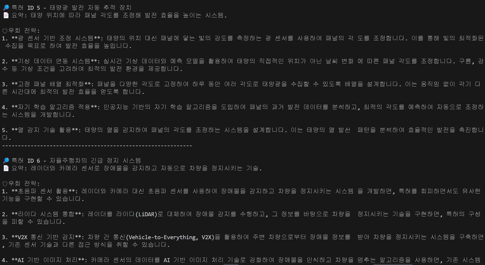

# llm_bypass

## 절차

### 의존성 설치

```bash
pip install openai python-dotenv
```

### 폴더 경로 이동

```bash
cd patent
```

.env에 gpt api key, 자신 local database 정보 삽입
(database에는 id(auto-increament), patent_number, title, summary 필드가 존재해야 함 | 해당 data는 일단 dummy data 삽입)

### 실행

```bash
python test3.py
```

## 출력


