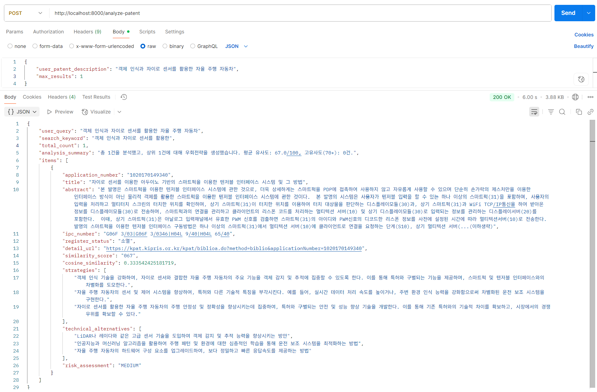

# llm_bypass_similarity

## 절차

### 의존성 설치

```bash
pip install fastapi uvicorn requests xmltodict openai python-dotenv numpy
```

.env에 OPENAI_API_KEY, KIPRIS_API_KEY 삽입

### 실행

```bash
python integrated_patent_api.py
```

## 출력


